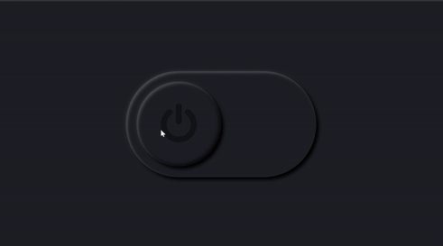
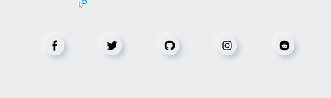
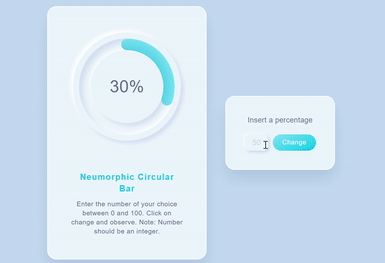

# Exploring-Neumorphism-UI

Neumorphism is currently a trend which is gaining more and more attention these days on both Dribble and Instagram. This entire hype started with one dribble shot that went viral.

## Whats the difference between Normal and Neumorphic UI ?
Buttons haven't changed much. But what has changed is the actual cards concept which makes this new style more attractive.
A Modern Material card usually is a surface floating on top of our perceived background and casting a shadow onto it. The shadow both gives it depth and also in many cases defines the shape itself  and it’s often borderless.

Neumorphic card however pretends to extrude from the background. It’s a raised shape made from the exact same material as the background. When we look at it from the side we see that it doesn’t “float”.

You can read more about Neumorphic UI [here](https://uxdesign.cc/neumorphism-in-user-interfaces-b47cef3bf3a6).

In this repository, I will be going to expore this beautiful new trend in UI. You can also see all the present and future works on this topic [here](https://charmilgandhi.github.io/Exploring-Neumorphism-UI.io/).

## 1. Neumorphic Theme Toggler
Dark Mode already was in trend since 2020 beginning. And Neumorphic UI is the new big thing. Imagine what happens when we combine these 2 hypes.

Click :point_right: [here](https://charmilgandhi.github.io/Exploring-Neumorphism-UI.io/Neumorphic_Toggler/toggler.html) to see.

## 2. Neumorphic Social Media Icons with Hover Animations
Cool Neumorphic social media icons..!!! Just hover over them and bring them to their original colors.

Click :point_right: [here](https://charmilgandhi.github.io/Exploring-Neumorphism-UI.io/NeuIcons/neuIcons.html) to see.

## 3. Neumorphic Circular Progress Bar
Enter the number in the space given besides the circular progress bar and see the bar progress.

Click :point_right: [here](https://charmilgandhi.github.io/Exploring-Neumorphism-UI.io/NeuCircBar/neuCircBar.html) to see.

